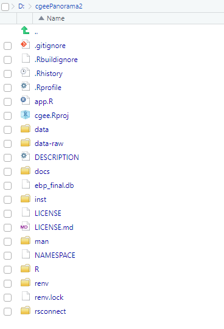
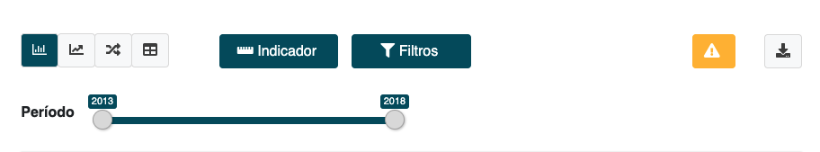

# Introdução

A estrutura geral do app utiliza o framework conhecido como `golem` (saiba mais [aqui](https://engineering-shiny.org/golem.html)) para construção do app.

As dependências do pacote foram administradas utilizando o pacote `renv` (saiba mais [aqui](https://rstudio.github.io/renv/articles/renv.html)).

A lista de todos os pacotes utilizados no projetos e suas respectivas versões estão no arquivo `renv.lock`.

---

# Usando o `renv`

`renv` é um pacote que implementa a lógica de dependências locais ao seu pacote. A ideia é que ele substitua o antigo `Packrat`. O passo a passo para usar esse pacote em um projeto é:

1. Inicie o uso do `renv` com `renv::init()`. Isso vai fazer com que, dentro do seu projeto, a sua biblioteca de pacotes fique numa pasta específica e exclusiva desse pacote.

2. Trabalhe normalmente no seu pacote, instalando o que você precisar com `install.packages` (vai afetar apenas sua pasta de dependências local).

3. Use `renv::snapshot()` para fazer salvar o estado atual dos seus pacotes (nome, versão e origem) para um arquivo `renv.lock`

4. Continue trabalhando normalmente.

5. Se você quiser atualizar o `renv.lock` com as novas dependências, use `renv::snapshot()`, se não, use `renv::restore()` para deixar sua biblioteca local exatamente com o que estiver registrado em `renv.lock`.

---

# Estrutura de arquivos do app

Os arquivos que geram o aplicativo estão divididos em:

- Script de preparação dos dados: `tab_auxiliares.R`

- Estrutura principal: `app_ui.R` e `app_server.R`

- Planilha excel com os títulos das abas e possíveis avisos que serão exibidos nas páginas: `data-raw/xlsx/textos_intro_secoes.xlsx`

- Módulos: 11 `shiny-modules` (scripts nomeados `R/mod_*.R`) que são funcionalidades individuais que se dividem em:
    - 1 módulo para a barra superior de filtros, chamado `mod_controles_padrao`;
    - 1 módulo que possibilidta o download dos dados de uma certa aba, chamado `mod_int_baixar_dados`;
    - 9 módulos com telas, gráficos etc, um para cada link clicável no menu à esquerda.
    
---

# Estrutura de arquivos do app

- Banco de dados SQLite, salvo na raiz do projeto no arquivo `ebp_final.db`.

- Arquivos auxiliares: scripts com funções simples utilizadas para construção de tabelas, gráficos, manipulações de bases de dados, parâmetros estéticos etc que foram usados em várias partes do código. Por isso, foram salvas em arquivos separados. Essas função estão na pasta `R`, salvas sob o padrão `utils_*.R`

- Arquivos `CSS` e `JavaScript` customizados: `inst/app/www/custom.css` e `inst/app/www/script.js`.

---

# Estrutura de arquivos do app

.pull-left[
```{r, echo = FALSE, out.width="80%"}

```
]

.pull-right[
- Sendo este um shiny app construído pelo pacote `golem`, os arquivos estão organizados como um `r-package`;

- O arquivo de leitura do SQLite com os dados do app é o `data-raw/tab_auxiliares.R`;

- Os módulos, a estrutura principal do app e os arquivos auxiliares estão na pasta `R`;

- Os arquivos `CSS` e `JavaScript` estão na pasta `inst/app/www/`.
]

---

# Arquivo de preparação 

O arquivo de preparação `data-raw/tab_auxiliares.R` possui as seguintes funções:

- conectar-se com o banco de dados `sqlite`;

- criar conexão com todas as tabelas do banco de dados que serão utilizadas no app, de tal forma que seja possível manipulá-las a partir de funções do `dplyr` antes de importar os dados para a memória;

- fazer algumas modificações nas tabelas do banco que facilitam a utilização dos dados dentro do app;

- criar tabelas auxiliares que facilitam a utilização dos dados dentro do app.


** Várias manipulações executadas nesse arquivo poderiam ser aplicadas diretamente no banco de dados para remover essa etapa do app, diminuindo o tempo de carregamento.**

---

# Estrutura geral do app

Este aplicativo, assim como todos os aplicativos utilizando o `golem`, está inteiramente definido em duas funções: `app_ui` e `app_server`.

- `app_ui` é uma função contendo todos os elementos gráficos da tela;
    - A página é construída utilizando o pacote `bs4Dash` e o layout com menu lateral.
    
    - Em `bs4Dash::bs4DashSidebar` (a barra lateral) ficam todos os itens do menu. Cada item do menu tem um parâmetro `tabName` que depois precisará ser declarado com esse mesmo nome em `bs4Dash::bs4TabItems`.
    
    - Em `bs4Dash::bs4TabItems` ficam os elementos gráficos que aparecem quando cada menu é selecionado. A correspondência entre itens do menu e o que aparece na tela é feita pelo parâmetro `tabName` dos `bs4Dash::bs4TabItem`. O conteúdo de cada `bs4Dash::bs4TabItem`, pelo design do app, é a ui de um modelo, que assume a forma `mod_*_ui("id")`.

---

# Estrutura geral do app    
    
- `app_server` é uma função com todas as lógicas executadas no servidor. Ele é composto por um código que escreve o título tomando como base o Excel e uma série de importações das lógicas específicas de cada módulo na forma `mod_*_server("id")`.

---

# Planilha excel com títulos e abas

Essa planilha contém o título, subtítulo e o aviso (disclaimer) utilizados em cada página do app. Além disso, também possui o nome da aba utilizado no menu lateral e `id` da aba utilizado dentro do app, para facilitar a identificação de cada página na planilha/código.

Para alterar o título, subtítulo ou disclaimer de qualquer página, basta alterar essa planilha. O valor `aviso_padrao` no campo `aviso` se refere ao disclaimer padrão apresentado, no momento, em todas as páginas. Para colocar um texto diferente, basta inseri-lo nesse campo da planilha.

---

# Módulos (geral) 

A lógica dos módulos é a mesma que a lógica geral do app: cada arquivo possui duas funções, uma para a interface do usuário e outra para a lógica. Essas duas funções sempre seguem o padrão `mod_*_ui` e `mod_*_server`. Elas precisam ser incorporadas no app principal alterando o `app_ui` e o `app_server`.

A chamada de qualquer uma das duas funções que definem um módulo precisa ser feita passando um parâmetro que criará o que aparenta ser um ambiente próprio para os inputs e os outputs. Na verdade, todos os outputs `out` criados por `mod_*_server("id")` são criados por `id-out` e precisam ser chamados no `mod_*_ui("id")` com `NS("id")`.

---

# Módulo de filtros

O módulo de filtros insere a seção de filtros, controles das visualizações, disclaimer e módulo de download para todas as páginas, exceto a `Explorar projetos`, que possui uma seção de filtros própria. 

```{r, echo = FALSE}

```


Esse módulo é chamado dentro do módulo de cada página, que pode passar como parâmetro os tipos de visualização e indicadores específicos da página. Os filtros são comuns a todas as páginas.

---

# Módulo de download 

O módulo de download dos dados permite que seja adicionado um botão que, a partir de um objeto reativo que retorne uma `tibble` ou `data.frame`. No objeto `mod_*_server` você precisa inserir a lógica relacionada ao download do app, encapsulada na função `mod_int_baixar_dados_server`. 

O botão padrão desse módulo é `mod_int_baixar_dados_ui(ns("int_baixar_dados_ui_1"))`

---

# Arquivos auxiliares

Além dos módulos e estrutura geral do app, na pasta `R` temos 5 arquivos auxiliares com funções utilizadas ao longo do app:

- `R/utils_graficos.R` contém todas as funções utilizadas para a construção de gráficos. Elas se chamam `ec_*` ou `plota_*`. Cada uma delas possui documentação própria que descreve a entrada esperada. No geral, essas funções devolvem gráficos prontos para plotagem no dashboard
    
- `R/utils_tabelas.R` contém as funções utilizadas para a construção de tabelas. Elas se chamam `tabela_*`
    
- O script `R/utils.R` constrói dois objetos que impactam diversas telas do app:
  - todos os gráficos usam as cores descritas no objeto `cores_epe`;
  - o tamanho da fonte dos gráficos usa o elemento chamado `tamanho_da_fonte` do objeto `parametros`;
  - as funções de formatação dos valores de tabelas.

---

# Arquivos auxiliares

- `R/utils_ui.R` contém funções utilizadas para construir diversos elementos da interface ao usuário, inclusive o conteúdo das mensagens de alerta que aparecem nas barras dos filtros

- `R/utils.R` contém as funções de preparação das tabelas que são insumos para os gráficos mais comuns (de nome `plota_*`)

---

# Observações gerais sobre o app

- A formatação do texto dos eixos dos gráficos pode ser alterada em `inst/app/www/script.js`.

- O favicon e o logo da EPE estão salvos em `inst/app/www`.

- A função `runApp` abre uma conexão com o banco e, quando o app é encerrado, fecha a conexão.

- Atualmente os textos dos disclaimers são todos iguais, mas podem ser alterados modificando o arquivo Excel de controle de títulos e incluindo um novo caso na sequência de condições dentro de `aviso_secao`.
